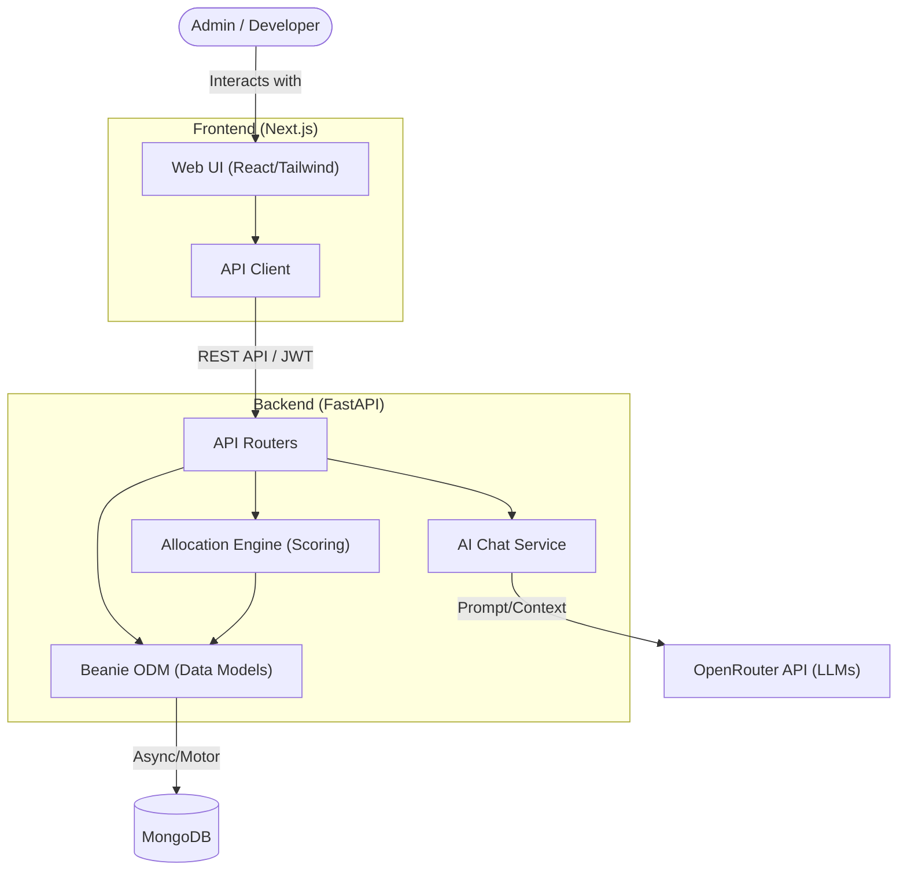

# WorkPigeon

WorkPigeon is an AI-powered task allocation platform built for software development teams. It uses a multi-metric scoring engine to intelligently assign and rebalance tasks across developers based on their current workload, skills, past performance, and AI usage efficiency.

This was built as a Semester VI academic project.


---

## What it does

The core idea is that assigning tasks manually is inefficient and biased. WorkPigeon automates this by scoring every developer against every task using four weighted signals, then picking the best match. It also supports team-wide rebalancing, where all active tasks are redistributed in one shot using a greedy algorithm that accounts for skill constraints.

The admin manages developers and tasks. Developers get a personal workspace with an AI chat assistant and a view of their own assigned work. All AI interactions are logged and factored into scoring over time.

---

## Scoring algorithm

Every developer is scored against a task out of 100 using this formula:

- Workload (25%) — developers with less current work score higher
- Past performance (25%) — based on average quality scores and on-time delivery from completed tasks
- Skill compatibility (30%) — how well the developer's skills match what the task requires
- AI efficiency (20%) — derived from the developer's AI interaction logs

The rebalance engine uses a least-flexibility-first approach: tasks with fewer qualified developers are assigned before tasks that anyone can do. Within the same priority tier, heavier tasks are distributed first to prevent large tasks from piling onto an already-loaded developer.


---

## Pages

**Login** — JWT-based authentication. Admins see the full dashboard. Developers are redirected to their personal workspace.

**Developers** — A card grid showing every registered developer. Each card shows workload level (Low / Medium / High), skills, commits, AI score, and an expandable list of assigned tasks. Admins can add or delete developers here.


**Tasks** — A Kanban board with four columns: Unassigned, In Progress, Review, and Done. Each unassigned task has an Auto Assign button that runs the scoring engine and assigns it immediately.


**Allocation Engine** — Runs a full team rebalance. Assigns all unassigned and in-progress tasks using the scoring algorithm and persists the results to the database.

**AI Logs** — Admin view of all AI chat interactions across the team, with an analytics summary.

**Developer Workspace** — Personal page for each developer showing their tasks, deadlines, and an AI chatbot they can use for help.


---

## Setup

### Requirements

- Node.js 18+
- Python 3.11+
- MongoDB

### Database Setup

You need a MongoDB database to run this project. You have two options:

**Option 1: Cloud (Recommended, Easiest)**
1. Go to [MongoDB Atlas](https://www.mongodb.com/cloud/atlas/register) and create a free account.
2. Create a new free cluster (M0).
3. Under "Database Access", create a new database user and password.
4. Under "Network Access", allow access from anywhere (`0.0.0.0/0`).
5. Click "Connect", choose "Drivers", and copy your connection string.
6. Replace `<password>` with your password and use this as your `MONGO_URI` in the `.env` file.

**Option 2: Local Install**
1. Download and install [MongoDB Community Server](https://www.mongodb.com/try/download/community). 
2. Make sure to install MongoDB Compass (included in the installer) to view your data visually.
3. Once installed, the database will run locally by default at `mongodb://localhost:27017`. You can use this as your `MONGO_URI` in the `.env` file.

### Backend

```bash
cd backend
python -m venv .venv
.venv\Scripts\activate
pip install -r requirements.txt
cp .env.example .env
# fill in your values in .env
python create_admin.py
python -m uvicorn app.main:app --reload --port 8000
```

API runs at `http://localhost:8000`. Interactive docs at `/docs`.

### Frontend

```bash
cd apps/web
npm install
npm run dev
```

App runs at `http://localhost:3000`.

### Seed data (optional)

```bash
cd backend
python seed.py
```

---

## Environment variables

Backend (`backend/.env`):

```
MONGO_URI=mongodb://localhost:27017
DB_NAME=workpigeon
SECRET_KEY=your-secret-key
OPENROUTER_API_KEY=your-openrouter-key
FRONTEND_URL=http://localhost:3000
```

Frontend (`apps/web/.env.local`):

```
NEXT_PUBLIC_API_URL=http://localhost:8000
```

---

## System architecture



## Project structure

```
WorkPigeon/
  apps/web/               Next.js 15 frontend
    app/                  Pages (login, developers, tasks, allocation, etc.)
    components/           React components
    lib/api.ts            Typed API client

  backend/
    app/
      routers/            API route handlers (auth, users, tasks, engine, chat)
      models/             Beanie ODM models
      services/scoring.py Core allocation algorithm
    create_admin.py       Create an admin user
    seed.py               Seed demo data
    requirements.txt
```

---

## Tech stack

- Frontend: Next.js 15, TypeScript, Tailwind CSS, Framer Motion
- Backend: FastAPI, Python 3.11
- Database: MongoDB, Beanie ODM, Motor
- Auth: JWT via python-jose
- AI: OpenRouter API
